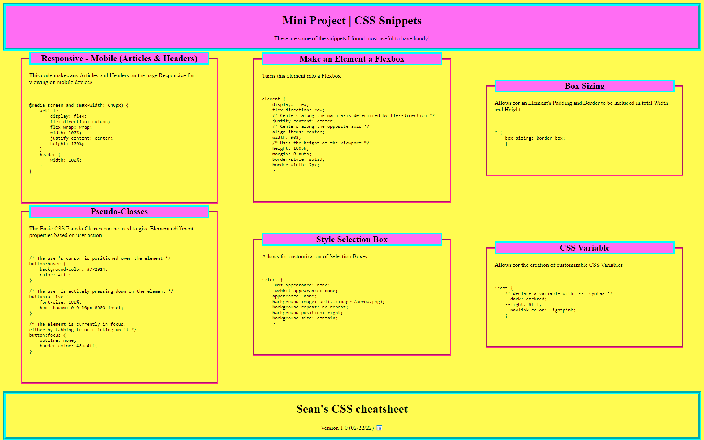

# CSS-Snippet-Cheatsheet

## Description
This cheatsheet contains CSS snippets that I found to be the most useful to have handy. The document can and will be added to over time. The primary goal is to streamline the CSS coding process.

## Visuals

## Technologies Utilized
This site was created using a combination of HTML and CSS.

## Authors and Acknowledgements
Sean Duiser:
sean.duiser.develop@gmail.com
704-296-8335

## Deployed Site
[link to the live site](https://sean-duiser.github.io/Mini-Project-CSS-Cheatsheet/) 
